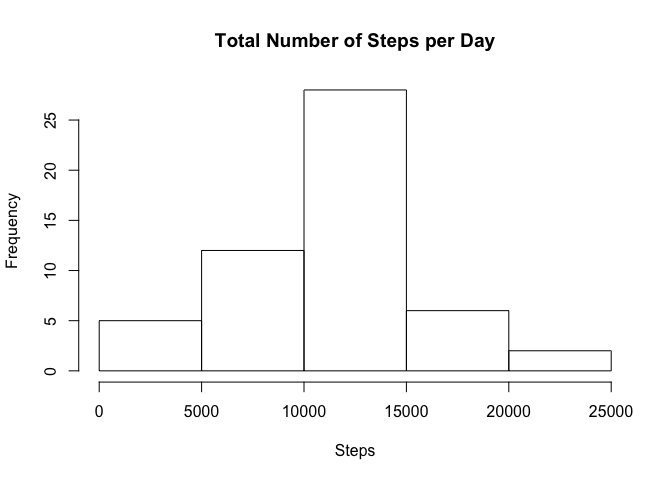
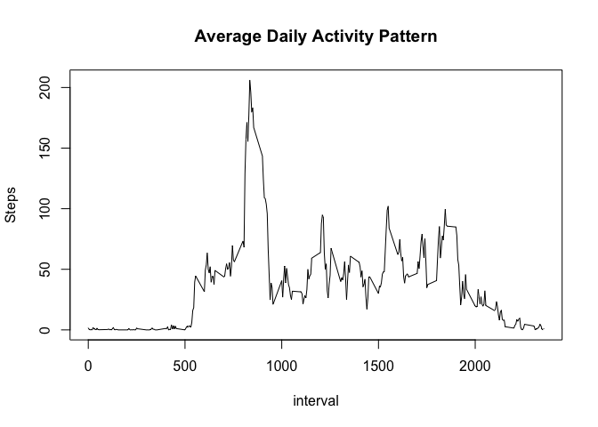
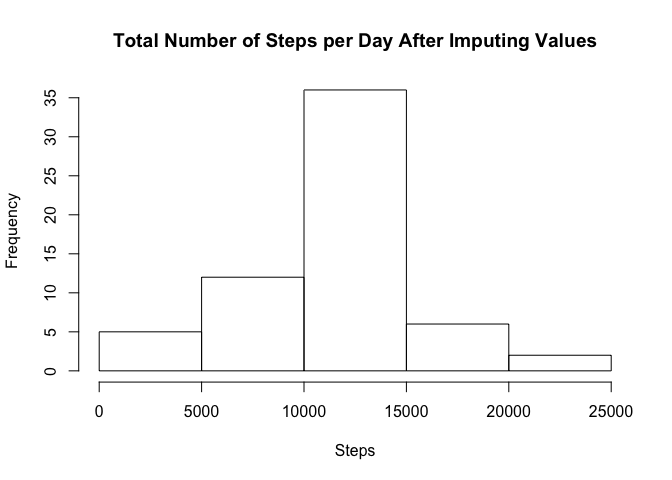
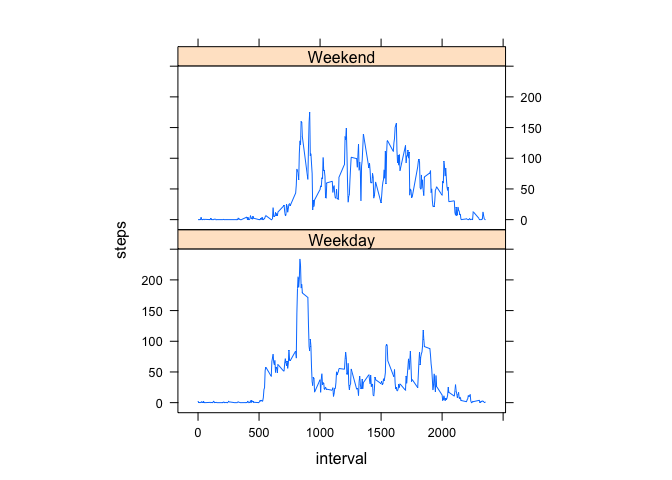

# Reproducible Research: Peer Assessment 1


## Loading and preprocessing the data
Unzip the file activity.zip and set the current workingdirectory to where the unzipped file "activity.zip" is located. \newline
Read the csv file and use aggregate(), steps per date i.e. Splits the data into subsets, computes summary statistics for each. Process/transform the data (if necessary) into a format suitable for your analysis.

```r
activity <- read.csv("activity.csv")
Steps<-aggregate(steps ~ date,activity,sum,na.rm=TRUE)
```
## What is mean total number of steps taken per day?
Make a histogram of the total number of steps taken each day


```r
hist(Steps$steps, xlab="Steps", main="Total Number of Steps per Day")
```

<!-- -->

Calculate and report the mean and median total number of steps taken per day.


```r
mean(Steps$steps)
```

```
## [1] 10766.19
```

```r
median(Steps$steps)
```

```
## [1] 10765
```


## What is the average daily activity pattern?
Make a time series plot (i.e. type = "l") of the 5-minute interval (x-axis) \newline
and the average number of steps taken, averaged across all days (y-axis). First aggregate steps per interval and compute mean for eachinterval.


```r
intervalmean <- aggregate(steps ~ interval, activity, mean) 
plot(intervalmean, type="l", ylab="Steps", main="Average Daily Activity Pattern")
```

<!-- -->

The interval, on average across all the days in the dataset,
contains the maximum number of steps.


```r
intervalmean$interval[which.max(intervalmean$steps)]
```

```
## [1] 835
```

## Imputing missing values


Use complete.cases() to find the total number of missing values. It returns a logical vector indicating which cases are complete, i.e., have no missing values.

```r
missingvalues <- sum(is.na(activity$steps))
missingvalues
```

```
## [1] 2304
```
Fill all missing values with mean for the interval. Create a new dataset that is equal to the original but with mean of the interval filled in .

```r
imp_activity <- activity
#loop through all rows
for (i in 1:nrow(activity)) {
    # is value missing
    if (is.na(activity$steps[i])) {
        # if missing replace with the mean for that interval
        imp_activity$steps[i] <- intervalmean$steps[which(intervalmean$interval == activity$interval[i])]
    }
}
```
New histogram with the new dataset of the total number of steps taken each day.


```r
imp_activity_per_day<-aggregate(steps ~ date,imp_activity,sum,na.rm=TRUE)
hist(imp_activity_per_day$steps, xlab="Steps", main="Total Number of Steps per Day After Imputing Values")
```

<!-- -->

Calculate and report the mean and median total number of steps taken per day after imputing values.


```r
mean(imp_activity_per_day$steps)
```

```
## [1] 10766.19
```

```r
median(imp_activity_per_day$steps)
```

```
## [1] 10766.19
```
The mean and median total number of steps per day are both 10766.19. It differs from the first part of the assignment.

## Are there differences in activity patterns between weekdays and weekends?
Add a column to activity dataset.

```r
activity <- read.csv("activity.csv")
activity$day <- weekdays(as.Date(activity$date)) #add a column with typ of day.
unique(activity$day) #
```

```
## [1] "Monday"    "Tuesday"   "Wednesday" "Thursday"  "Friday"    "Saturday" 
## [7] "Sunday"
```

```r
activity$day[activity$day == "Monday"] <- "Weekday"
activity$day[activity$day == "Tuesday"] <- "Weekday"
activity$day[activity$day == "Wednesday"] <- "Weekday"
activity$day[activity$day == "Thursday"] <- "Weekday"
activity$day[activity$day == "Friday"] <- "Weekday"
activity$day[activity$day == "Saturday"] <- "Weekend"
activity$day[activity$day == "Sunday"] <- "Weekend"
```
Plot activity pattern between weekdays and weekends. first aggregate steps per "interval and day" and compute mean.


```r
intervalmean_day <- aggregate(steps ~ interval+day, activity, mean) 
library(lattice)
xyplot(steps~interval|factor(day),
       intervalmean_day,
       aspect=1/2,
       type="l")
```

<!-- -->
